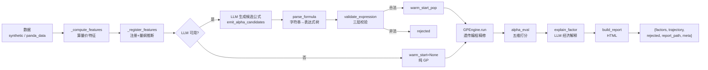

# LLM-Alpha 因子挖掘

## Purpose

把「量价数据」转成一批**可解释、可复盘的公式化 alpha 因子**：

1. 拉数据（真实 panda_data 日线，或造带已知信号的合成 OHLCV 供离线验收）。
2. 算一批日频量价特征并注册进动态特征表，陌生特征自动推断量纲。
3. LLM 主导生成 N 个候选公式（前缀函数式），强制 tool use 返回。
4. 三层校验（白名单 / 量纲 / 前视）过滤候选，被拒的记入 rejected。
5. 合法候选作 warm-start 种子交给遗传编程（GP）精修演化。
6. 对 top_k 因子做 AlphaEval 五维打分（预测力 / 稳定性 / 鲁棒性 / 逻辑 / 多样性）。
7. LLM 生成每个因子的经济解释（可选）。
8. 产自包含 HTML 报告并返回结构化结果。

本 skill 只负责**因子挖掘与样本内评估**。它**不做回测**：严格样本外裁决、费率/滑点/资金费率归回测 skill。

## Mandatory LLM Policy

Read `references/method_guide.md` for the workflow, `references/llm_policy.md` for the runtime contract, and `references/review_checklist.md` before publishing a result. Load `data_guide.md`, `operator_spec.md`, `fitness_guide.md`, and `output_contract.md` only when their details are needed.

LLM is permanently mandatory for candidate generation, dimension inference, AlphaEval logic scoring, and economic explanation. Any unavailable client, failed call, malformed tool result, or missing field is a hard failure; no downgrade, neutral score, template explanation, pure-GP result, or report publication is allowed. The only user configuration entry is `config.llm`. When it contains external settings, `base_url`, `api_key`, `model`, and `protocol` must all be present and every LLM stage must share the same runtime client. Without external settings, use the current tool host model and do not request an API key. `enabled`, `provider`, environment switches, and alternate configuration paths are forbidden.

## Agent LLM Contract

在 Codex / Claude Code / Cursor 等环境中，未配置外部模型时使用当前宿主 AI；配置外部模型时所有阶段统一使用唯一的 `config.llm` 入口。

| 场景 | 必须使用的方式 | 禁止事项 |
|---|---|---|
| 当前工具正在执行本 skill | 宿主 AI 提供真实 LLM 结果 | 缺少结果必须报错 |
| 用户配置外部模型 | 使用唯一 `config.llm`，四个外部字段必须齐全 | 禁止第二套配置和静默降级 |
| 任意 LLM 阶段失败 | 立即终止且不发布报告 | 禁止纯 GP、中性分和模板解释 |

agent provider 最小配置：

```python
out = run(
    "AU_DOMINANT.SHF", "20240101", "20260714",
    config={
        "llm": {
            "enabled": True,
            "provider": "agent",
            "agent_payload": {
                "model": "current-agent",
                "formulas": [
                    "ts_corr(ma10, atr14, 30)",
                    "diff(ts_corr(open_interest, open, 30), 5)",
                ],
                "explanations": {
                    "ts_corr(ma10, atr14, 30)": {
                        "explanation": "衡量短期均线与真实波幅的滚动相关性，捕捉趋势推进时波动是否同步放大或收敛。",
                        "captures": "短趋势与波动扩张的联动。",
                        "applicable_scenario": "适合趋势延续和波动放大的小时级行情。",
                        "failure_scenario": "震荡市中均线和波动关系易反复切换。"
                    }
                }
            },
        },
    },
)
```

若 agent payload 没有解释，报告必须显示“当前 agent 尚未提供经济解释”，**不能机械复读公式**。

## Input / Output Contract

### 输入

`run(universe, start_date, end_date, config=None) -> dict`

| 参数 | 类型 | 说明 |
|---|---|---|
| `universe` | str \| list | 标的代码（单标的时序；列表取第一个），如 `RB2405.SHF` / `000001.SZ` |
| `start_date` | str | 起始日 `YYYYMMDD`（真实数据模式透传 data_loader） |
| `end_date` | str | 结束日 `YYYYMMDD` |
| `config` | dict \| None | 配置（见下） |

`config` 字段（全部可选）：

| 键 | 默认 | 说明 |
|---|---|---|
| `llm` | `{}` | 唯一 LLM 配置入口；外部模式必须同时提供 `base_url`、`api_key`、`model`、`protocol` |
| `n_candidates` | 12 | LLM 候选公式个数 |
| `top_k` | 5 | 最终入选因子数 |
| `gp` | `{}` | `{pop_size:80, n_gen:15, max_depth:6, elite_frac:0.05, crossover_rate:0.7, mutation_rate:0.2, seed:42}` |
| `data` | `{}` | `{use_synthetic:bool, asset_type:'auto', username, password}` |
| `output_dir` | `../output` | HTML 报告输出目录 |

> LLM 永久强制开启。未配置外部字段时使用当前工具宿主模型；配置外部模型时所有阶段共用 `config.llm`。禁止 `enabled`、`provider` 和环境变量开关。

### 输出

`run()` 返回 dict，五个顶层键：

| 键 | 类型 | 说明 |
|---|---|---|
| `factors` | list[dict] | 入选因子（公式 / 五维分 / rankIC / 经济解释 / 信号统计） |
| `trajectory` | list[dict] | GP 每代演化轨迹 |
| `rejected` | list[dict] | 被解析/校验拒绝的候选（含 formula / reason / layer / source） |
| `report_path` | str \| None | 自包含 HTML 报告路径 |
| `meta` | dict | 运行元信息（LLM 状态 / 数据源 / 超参 / warnings） |

单个 factor 结构与 factor JSON schema 见 [references/output_contract.md](references/output_contract.md)。

## Workflow



## Scripts

| Script | 职责 |
|---|---|
| `scripts/generate.py` | 主入口 `run()` + `parse_formula()`；串联全流程，CLI 冒烟自检 |
| `scripts/expression.py` | 表达式树 `Node` + `evaluate` / `to_formula_string` / `random_tree` / `count_nodes` |
| `scripts/operators.py` | 22 个算子白名单（`OPERATORS` / `OPERATOR_NAMES`），求值函数 |
| `scripts/feature_registry.py` | 动态特征注册表（不写死白名单，运行时注册 + 量纲回填） |
| `scripts/dimension_inferrer.py` | 量纲自动推断（stat / name / llm 三票投票） |
| `scripts/validator.py` | 三层校验 `validate_expression`（白名单 / 量纲 / 前视） |
| `scripts/fitness.py` | GP 适应度 `evaluate_fitness`（RankIC × 换手惩罚 - 多样性 - 复杂度） |
| `scripts/gp_engine.py` | `GPEngine` warm-start 遗传编程引擎 |
| `scripts/data_loader.py` | panda_data 期货/股票日线接入 `load_ohlcv` |
| `scripts/alpha_eval.py` | AlphaEval 五维打分 `alpha_eval` |
| `scripts/llm_explainer.py` | 使用共享客户端生成经济解释 |
| `scripts/report_builder.py` | `build_report` 自包含 HTML 报告 |
| `scripts/tests_*.py` | 各模块回归测试 |

## Run

```python
import sys
sys.path.insert(0, "scripts")
from generate import run

# 纯 GP（不启用 LLM），合成数据离线验收
out = run(
    "SYNTH", "20230101", "20241231",
    config={
        "data": {"use_synthetic": True},
        "gp": {"pop_size": 80, "n_gen": 15},
        "top_k": 5,
    },
)

# 真实期货 + agent 当前模型主导生成
out = run(
    "RB2405.SHF", "20230101", "20241231",
    config={
        "llm": {
            "enabled": True,
            "provider": "agent",
            "agent_payload": {"formulas": ["ts_mean(close, 5)"]},
        },
        "n_candidates": 12,
        "data": {"use_synthetic": False},
    },
)

for f in out["factors"]:
    print(f["formula"], f["rankic"], f["alpha_scores"]["weighted_score"])
```

CLI 冒烟：

```bash
# 无参数：合成数据 + 纯 GP 跑通
python scripts/generate.py
# 带参
python scripts/generate.py --universe RB2405.SHF --start 20230101 --end 20241231 --llm
python scripts/generate.py --synthetic          # 合成数据离线验收
```

## LLM Rules

- 候选生成、量纲判断、AlphaEval logic、经济解释全部强制调用 LLM；任一阶段失败直接抛错，不允许纯 GP、空解释或 logic=0.5 降级。
- 严禁创建 `LocalLLMClient`、mock client、模板解释器来冒充当前工具大模型。没有真实 agent 产物时，必须标记缺失或显式关闭 LLM。
- LLM 参与三处：**候选公式生成**（`emit_alpha_candidates`）、**量纲推断投票**（一票）、**因子经济解释**（`emit_explanation`）。三处全部**强制 tool use**，非 tool_use 回复一律降级。
- LLM **只产文字与它自己那一维的数值分**（金融逻辑 1-10），**绝不回流修改** rankIC / fitness / 五维其它分 / 信号数值。
- 生成公式时算子集是**硬约束**：只能用 22 个白名单算子，只能引用已注册特征，量纲不一致不能加减；越界候选会被三层校验拦下记入 rejected。
- 任意共享客户端缺失、网络错或 schema 不合都必须直接报错，不得读取环境变量或切换到其他 provider。

详见 [references/llm_policy.md](references/llm_policy.md) 与 [references/operator_spec.md](references/operator_spec.md)。

## Guardrails

- **不做回测**：只做样本内 RankIC / 五维打分。严格样本外裁决、费率 / 滑点 / 资金费率归回测 skill，本 skill 不越界。
- **无前视**：所有特征都是回看的；时序算子窗口 `n >= 0` 由校验器保证，负窗口视作读未来数据被拒。
- **量纲一致**：`add`/`sub` 两侧必须同量纲，否则判非法（防止 price + volume 之类无意义组合）。
- **LLM 不改数值**：所有可量化结论由确定性代码产出，LLM 只产 narrative / 经济解释 / 逻辑维评分。
- **数据来源可信**：正式生产行情走 panda_data；合成数据仅用于离线验收，不得作为正式结论依据。
- 有效样本 < 30 时 fitness / rankIC 判 0，此类信号在演化中被自然淘汰。

## References

- [references/operator_spec.md](references/operator_spec.md) — 22 算子白名单（LLM prompt 硬约束）
- [references/data_guide.md](references/data_guide.md) — panda_data 期货/股票日线接入口径
- [references/llm_policy.md](references/llm_policy.md) — LLM 调用边界八条硬约束
- [references/fitness_guide.md](references/fitness_guide.md) — 适应度与 AlphaEval 五维设计
- [references/output_contract.md](references/output_contract.md) — run() 返回结构 + factor JSON schema
